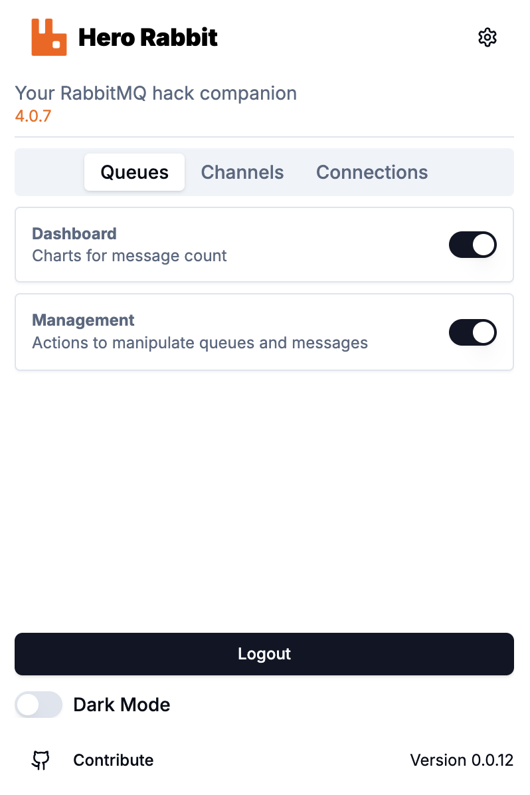

# Hero Rabbit

## Overview

This project is not officially supported by the original RabbitMQ developers. It was created to enhance the RabbitMQ Management Plugin by adding administrative tasks that are frequently performed in day-to-day operations while managing multiple RabbitMQ clusters.

  

## Getting Started with Development Environment

### Prerequisites

After checking out the project, you will find three main folders in the repository:

1. **Playground**
   - This folder contains a `docker-compose` file that sets up a RabbitMQ cluster. You can start this container to test the extension’s execution.
2. **Scripts**
   - This folder contains scripts to simulate messages in queues, user connections, and channels. Feel free to enhance these scripts to cover additional use cases.
3. **Extension**
   - This folder contains the main project. To run it, execute the command `npm run build:watch`, then install the `dist` folder in Chrome using development mode.
   - If you make changes while the build command is running in watch mode, the extension will automatically update in real time (hot reload), reflecting your modifications immediately.

## Privacy Policy

This project respects user privacy and follows best practices to protect personal data. No data is collected externally. All data managed by this extension is stored exclusively in your Google Chrome local storage, ensuring that no information is leaked outside your organization.

### Data Collection

- This extension does not collect or transmit any user data.
- All stored data remains local to your browser.

### Security

- Data is securely stored within Google Chrome's local storage.
- No external servers or third parties have access to the stored data.

### User Rights

- Users can manage and delete stored data directly from their browser settings.

## Quality Gates

